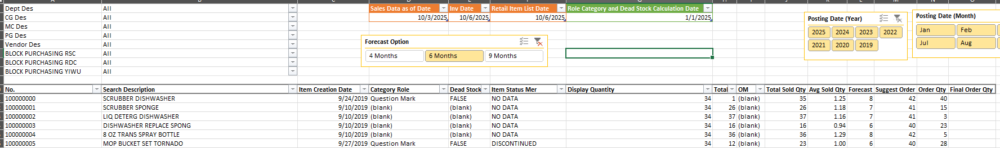

# 🌍 International Purchasing Insights Report
> _Hỗ trợ quá trình ra quyết định mua hàng Quốc tế dựa trên dữ liệu thực tế, thay vì kinh nghiệm cảm tính._
---

## 📘 Giới thiệu
Trước đây, việc mua hàng Quốc tế của phòng Merchandise chỉ dựa trên **file Sales Report tổng hợp**, không chuyên biệt cho hàng nhập khẩu.  
Điều này khiến việc phân tích trở nên khó khăn — **thiếu các chỉ số đặc thù** như: loại hàng, vendor, thương hiệu, trạng thái SKU, và thông tin “block purchasing”.  

Để giải quyết vấn đề này, dự án **“International Purchasing Insights Report”** được thực hiện nhằm:
- Tập trung toàn bộ dữ liệu liên quan đến **SKU nhập khẩu**.  
- Cung cấp **các chỉ số định lượng & định tính** cần thiết cho việc ra quyết định mua hàng quốc tế chính xác và chủ động.  
- Cho phép **phân tích linh hoạt theo nhiều chiều**: thời gian, thương hiệu, vendor, ngành hàng, trạng thái SKU.

---

## 🎯 Mục tiêu dự án
- Xây dựng một **bộ báo cáo chuyên biệt** phục vụ riêng cho việc mua hàng quốc tế.  
- Hỗ trợ quản lý Merchandise trong việc **đưa ra quyết định mua hàng chính xác, phù hợp với chu kỳ và kế hoạch nhập hàng dài hạn**.  
- Đảm bảo dữ liệu thống nhất, cập nhật và có khả năng mở rộng cho các kỳ mua hàng sau.

---

## 🧩 Giải pháp thực hiện

1. **Tổ chức & cấu trúc dữ liệu**
   - Chuẩn hóa hệ thống dữ liệu liên quan: Sales, Forecast, Vendor, Item Master, Order Minimum (OM), Item Status, Block Purchasing List...
   - Thiết lập cấu trúc thư mục, quy trình cập nhật và đặt tên file để đảm bảo tính logic, dễ mở rộng và kiểm soát.

2. **Tổng hợp dữ liệu bằng Power Query**
   - Kết hợp các nguồn dữ liệu rời rạc về một nơi.  
   - Làm sạch và chuẩn hóa dữ liệu (SKU, Vendor Name, Item Group, v.v).  
   - Tự động hóa quá trình cập nhật dữ liệu hàng kỳ.

3. **Xây dựng Data Model & tính toán bằng DAX**
   - Tạo mối quan hệ giữa các bảng dữ liệu trong Power Pivot.  
   - Viết DAX để tính toán các chỉ số cần thiết:
     - Doanh số và doanh thu theo SKU nhập khẩu  
     - Forecast Options (4 tháng / 6 tháng / 9 tháng)  
     - Suggest Order Quantity  
     - Order Minimum (OM) và trạng thái Item Status  
     - Lọc SKU thuộc “Block Purchasing” để loại khỏi danh sách gợi ý

4. **Thiết kế báo cáo (Report)**
   - Sử dụng **Pivot Table** thay vì biểu đồ để hiển thị số liệu chi tiết (vì quản lý cần dữ liệu cụ thể).  
   - Thiết lập **Slicer** cho Brand, Vendor, Country, Category, Forecast Option, v.v.  
   - Thảo luận với quản lý để tối ưu giao diện và tần suất cập nhật theo lịch mua hàng quốc tế.

---

## 📊 Kết quả đạt được
- **Tối ưu hóa hiệu suất mua hàng quốc tế**: có dữ liệu đầy đủ để ước lượng thời gian nhập hàng, tính toán nhu cầu, và ra quyết định hợp lý.  
- **Mua đúng – mua đủ – mua có cơ sở dữ liệu**, tránh mua các sản phẩm đã “block purchasing”.  
- **Báo cáo tập trung, thống nhất** giữa Buyer và Quản lý, đảm bảo ra quyết định dựa trên cùng một nguồn dữ liệu.  
- **Nâng cao tính minh bạch và khả năng truy vết** trong quá trình đề xuất và phê duyệt đơn hàng quốc tế.

---

## 🛠️ Công cụ & Kỹ thuật sử dụng
| Công cụ / Kỹ thuật | Mục đích sử dụng |
|--------------------|----------------|
| **Excel Power Query** | Tổng hợp và làm sạch dữ liệu từ nhiều nguồn |
| **Power Pivot (Data Model)** | Tạo mối quan hệ giữa các bảng dữ liệu |
| **DAX** | Tính toán Forecast Options, OM, Suggest Order Qty |
| **Pivot Table / Slicer** | Hiển thị báo cáo và hỗ trợ lọc linh hoạt |
| **Folder Data Structure** | Quản lý dữ liệu nhập khẩu rõ ràng, dễ cập nhật |

---

## 📸 Kết quả
### Hình ảnh Report

  

---

## ✉️ Tác giả
**Tram Dang Tai**  
📍 Merchandise Assistant Database  
📧 [Liên hệ qua LinkedIn](https://www.linkedin.com/in/tramdangtai)
